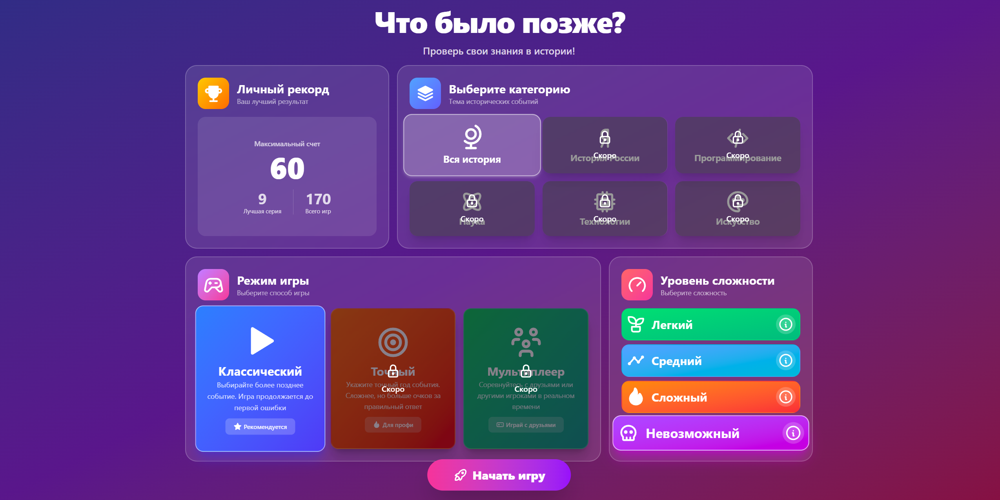
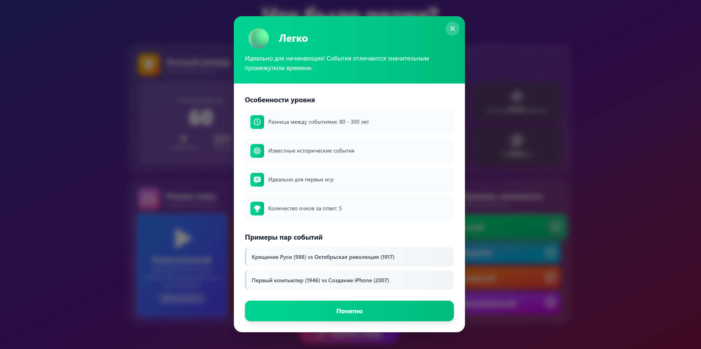
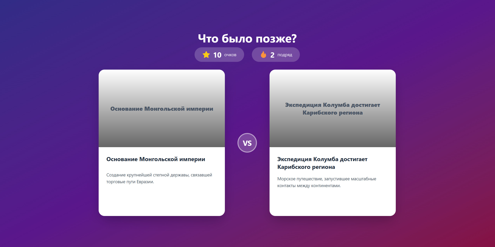
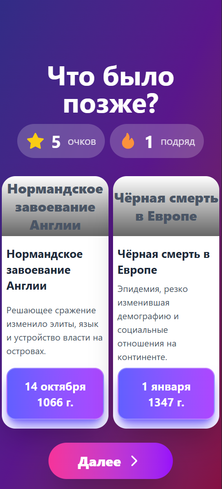
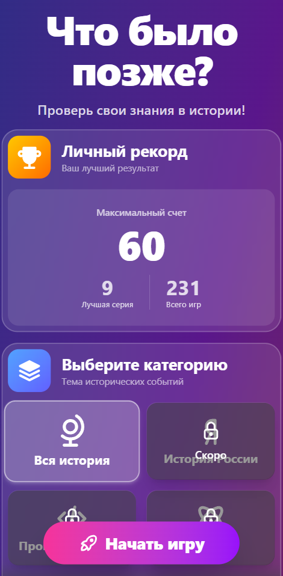

# Что было позже? 🕰️

Игра на знание исторических событий в хронологическом порядке. Проверь свои знания в истории и узнай, что произошло раньше, а что позже!

## 🎮 Описание игры

"Что было позже?" - это увлекательная викторина, которая проверит ваши знания истории. В игре представлены значимые исторические события от древности до наших дней. Ваша задача - определить, какое из двух событий произошло позже. Игра реализована полностью на фронтенде.

## 📚 Исторические события

В игре представлено более 100 исторических событий, охватывающих:

- Древний мир (Месопотамия, Египет, Греция, Рим)
- Средневековье (Рыцари, Крестовые походы, Монголы)
- Новое время (Реформация, Просвещение, Колонизация)
- Новейшее время (Мировые войны, Космическая эра, Интернет)

### Desktop версия





### Мобильная версия




## 🚀 Установка и запуск

### Требования

- Node.js (версия 14 или выше)
- npm или yarn

## 🛠️ Технологии

- **React 19**
- **Redux Toolkit**
- **React Router v7**
- **Tailwind CSS v4**
- **TypeScript**
- **Vite**
- **Motion**
- **Tabler Icons**

## 📊 Структура проекта

Проект следует архитектуре Feature-Sliced Design:

```
src/
├── app/
├── entities/
├── features/
├── pages/
├── shared/
└── widgets/
```

### Установка

1. Клонируйте репозиторий:

```bash
git clone https://github.com/Lyaguh21/what-was-later
cd what-was-later
```

2. Установите зависимости:

```bash
npm install
# или
yarn install
```

### Запуск

Для запуска в режиме разработки:

```bash
npm run dev
# или
yarn dev
```

Для сборки проекта:

```bash
npm run build
# или
yarn build
```
